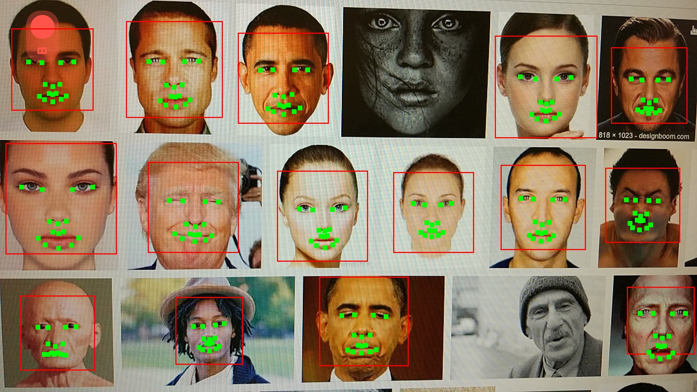
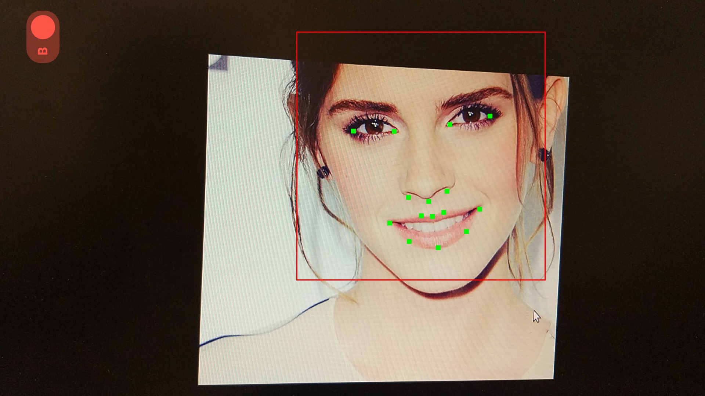

#### Example

#### Steps

1. calibrate according orientation, camera index, check [this post](http://zhengrui.github.io/android-coordinates.html).

2. face detection using opencv haar cascade detector. (scaled to max edge size = 480)

3. filtering: for each face from previous step, apply skin filter + dlib hog based face detector. dlib detector is slower but with less false positive. (scaled to max edge size = 960)

4. landmarks detection using dlib, very fast. (original size)

5. alignment: [68 points template image](https://github.com/cmusatyalab/openface/blob/master/images/dlib-landmark-mean.png), their coordinates can be found [here](https://github.com/cmusatyalab/openface/blob/master/openface/align_dlib.py). You can either use the template coordinates or your targeted aligned landmarks coordinates (e.g. scale and translation on top of template coordinates) to do affine transformation and cropping. The cropped images will be aligned and saved for feature extraction (if needed).

#### Setup

1. modify relevant paths in `faceDetAlignLib/build.sh` and `faceDetAlignLib/CMakeLists.txt`, run `build.sh`

2. download dlib landmarks detection model from [here](http://dlib.net/files/shape_predictor_68_face_landmarks.dat.bz2)

3. `adb push shape_predictor_68_face_landmarks.dat /sdcard/FaceDetAlignApp/`

#### Reference

+ [openface 0.2.0 post](http://bamos.github.io/2016/01/19/openface-0.2.0/)

+ [A Lightened CNN for Deep Face Representation](http://arxiv.org/abs/1511.02683)
